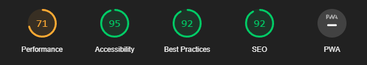

# 作業2 前端效能調校-當機等候網頁

`
姓名: 張牧翔
學號: D1035899
`

- 目標網站: [https://www.worldcubeassociation.org/](https://www.worldcubeassociation.org/)
- 作業網站(調校前): [https://d1035899.github.io/HW1/](https://d1035899.github.io/HW1/)
- 作業網站(調校後): [https://d1035899.github.io/HW2/](https://d1035899.github.io/HW2/)
- Code Repo: [https://github.com/D1035899/HW2](https://github.com/D1035899/HW2)

---

## 目錄

- [作業2 前端效能調校-當機等候網頁](#作業2-前端效能調校-當機等候網頁)
  - [目錄](#目錄)
  - [網頁效能測試](#網頁效能測試)
    - [調校前的分數](#調校前的分數)
    - [調校後的分數](#調校後的分數)
    - [設計當機網頁的想法](#設計當機網頁的想法)
  - [Code 講解](#code-講解)
    - [HTML](#html)
    - [CSS](#css)
    - [JavaScript](#javascript)
  - [心得](#心得)

---

## 網頁效能測試

### 調校前的分數



### 調校後的分數


### 設計當機網頁的想法

- 需要讓使用者了解目前網頁無法處理用戶需求，也就是網頁當機
- 直覺的導引按鈕
- 搭配文字及圖片來點綴網頁
- 使用轉動的魔術方塊來讓網頁更加符合其風格

---

## Code 講解

- 只放上有修改的部分code

> code的介紹皆由註解來解釋

### HTML

```html

```

### CSS

```css

```

### JavaScript

```js

```

---

## 心得

這次的作業讓我了解到在寫出一個好看好用的網頁，除了需要考慮到排版以外，還需要考慮網頁的效能。
網頁效能如果不好，將會導致使用者在使用上會有不好的體驗，而且也有可能會因為裝置較差或者網路不好導致網頁跑不出來或是跑不動。
希望以後在寫網頁是能夠在第一時間就去考慮到這些東西，如此就不用花太多時間去做效能檢測。
