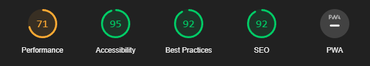
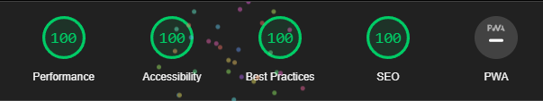
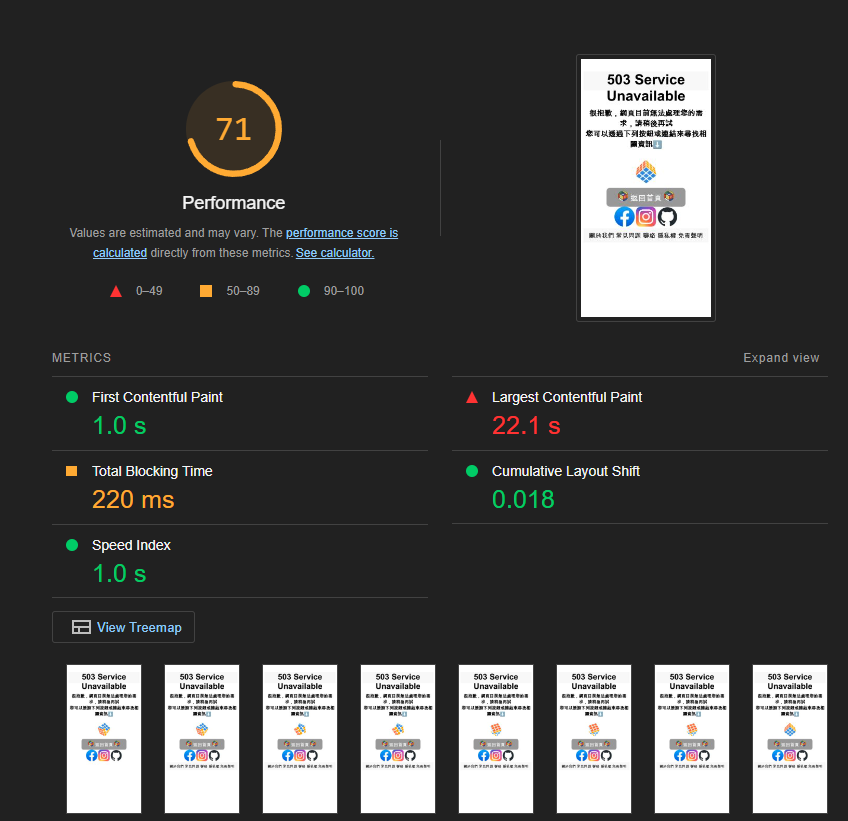
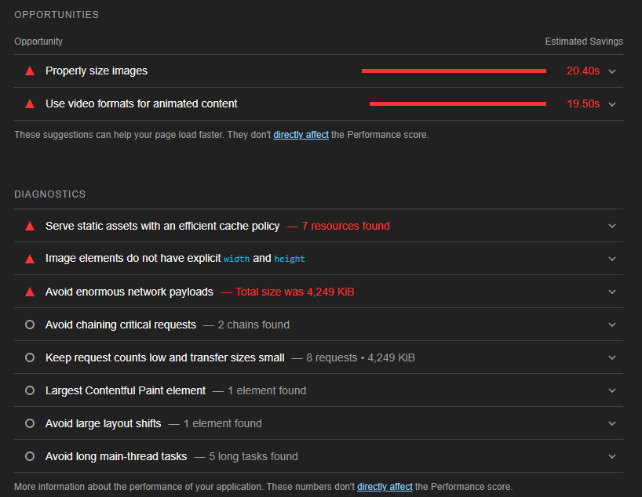
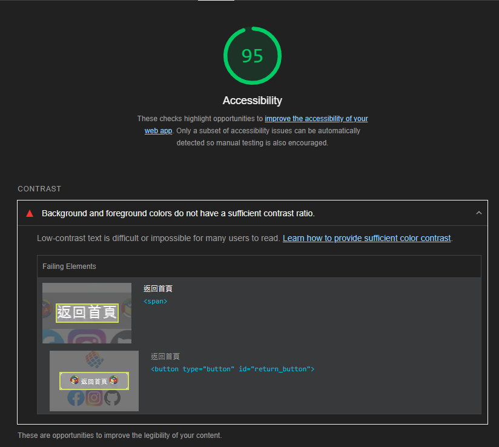
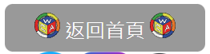
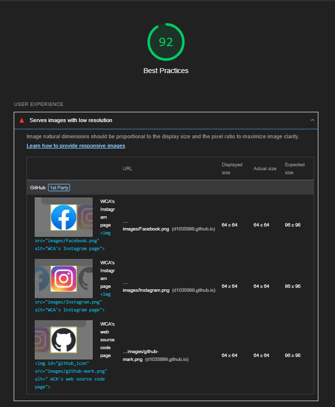
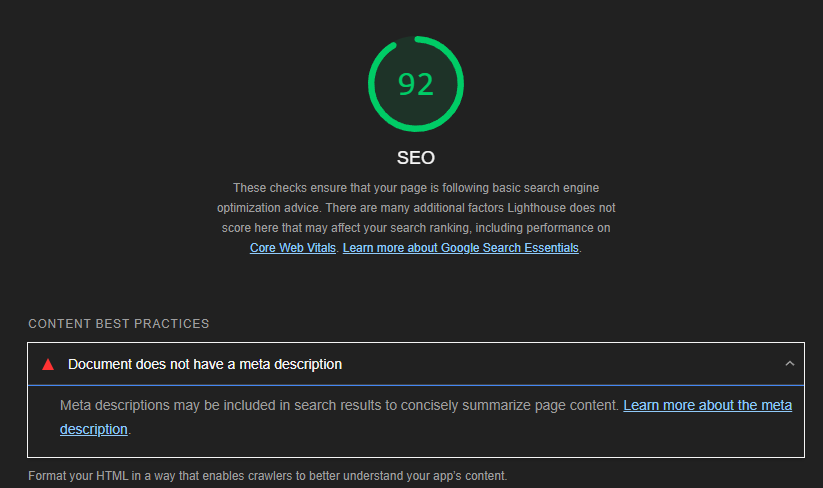

# 作業2 前端效能調校-當機等候網頁

`
姓名: 張牧翔
學號: D1035899
`

- 目標網站: [https://www.worldcubeassociation.org/](https://www.worldcubeassociation.org/)
- 作業網站(調校前): [https://d1035899.github.io/HW1/](https://d1035899.github.io/HW1/)
- 作業網站(調校後): [https://d1035899.github.io/HW2/](https://d1035899.github.io/HW2/)
- Code Repo: [https://github.com/D1035899/HW2](https://github.com/D1035899/HW2)

---

## 目錄

- [作業2 前端效能調校-當機等候網頁](#作業2-前端效能調校-當機等候網頁)
  - [目錄](#目錄)
  - [網頁效能測試](#網頁效能測試)
    - [調校前的分數 : 350](#調校前的分數--350)
    - [調校後的分數 : 400(滿分)](#調校後的分數--400滿分)
  - [效能調校講解](#效能調校講解)
    - [Performance](#performance)
    - [Accessibility](#accessibility)
    - [Best Practices](#best-practices)
    - [SEO](#seo)
  - [心得](#心得)

---

## 網頁效能測試

### 調校前的分數 : 350



### 調校後的分數 : 400(滿分)



---

## 效能調校講解

- 只放上有修改的部分code

### Performance




```html
<!-- 修改前的code -->
<div>
  
</div>
----------------------------------------------------------------------------------------

<!-- 修改後的code -->
<div>
  <video  id = 'rubik_cube' loop autoplay muted width="500" height="500">
    <source src="images\rubik_s_cube.webm" type = "video/webm" />
    </video>
</div>
```

- 透過將 rubik's_cube 的檔案格式從 gif 變為 webM 來降低檔案的大小，如此就不會影響網頁的載入
  - [調整工具點此](https://convertio.co/zh/gif-webm/)
- 使用`<video>`將影片設定其屬性以及大小:
  - loop: 循環播放
  - autoplay: 網頁載入好就自動撥放影片
  - muted:將影片靜音(chrome只允許muted的影片自動撥放)
- 將 code 裡的所有圖片都增加 width 和 height屬性來調整圖片大小

### Accessibility



- 透過改變按鈕的顏色來讓字體和按鈕的背景更加顯眼
- 改變前
  - 預設按鈕
  
  - 游標覆蓋至按鈕區域時
  
  - 點擊按鈕時
  
- 改變後
  - 預設按鈕
  
  - 游標覆蓋至按鈕區域時
  
  - 點擊按鈕時
  

### Best Practices



- 透過網路上的線上轉檔工具將我所使用的 icon 的解析度大小都調整成96 x 96
  - [調整工具網頁點此](https://www.iloveimg.com/resize-image)

### SEO



```html
<meta name="description"
      content="Author: Chang-Mu-Xiang,
               Student ID: D1035899,
               Department: IECS,
               Web-programming HW2">
```

在`<head>`裡加入敘述，該敘述並不會出現在自己的網頁中，但是在使用搜尋引擎搜尋該網頁時，就會出現此敘述，幫助使用者了解資訊

---

## 心得

這次的作業讓我了解到在寫出一個好看好用的網頁，除了需要考慮到排版以外，還需要考慮網頁的效能。
網頁效能如果不好，將會導致使用者在使用上會有不好的體驗，而且也有可能會因為裝置較差或者網路不好導致網頁跑不出來或是跑不動。
希望以後在寫網頁是能夠在第一時間就去考慮到這些東西，如此就不用花太多時間去做效能檢測。
